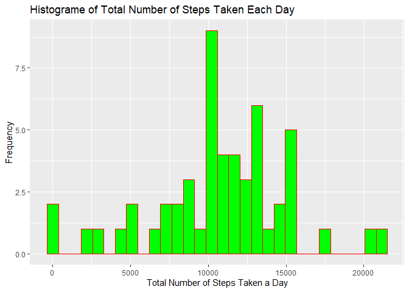
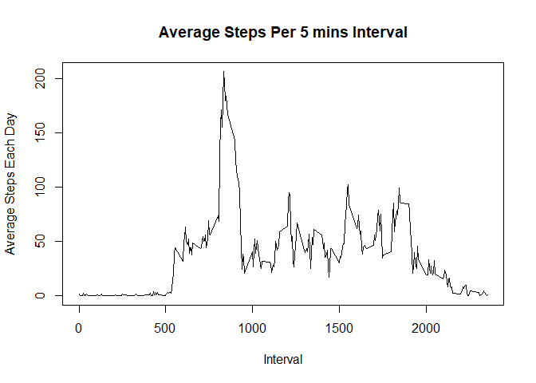
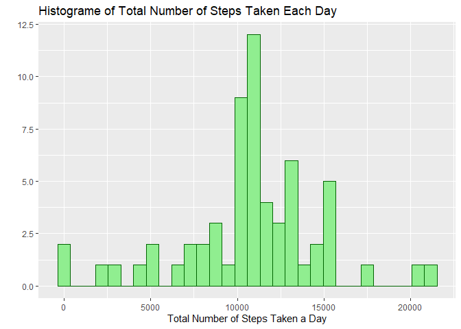
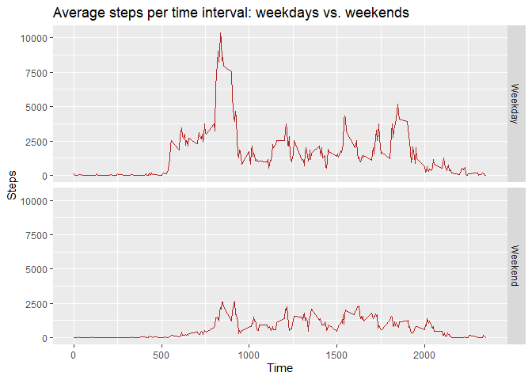

### Loading and preprocessing the data

```r
dat <- read.csv("activity.csv")
```

### The mean total number of steps taken per day?

```r
total_num_stp_day <- tapply(dat$steps, dat$dat, sum )
library(ggplot2)
qplot(total_num_stp_day, geom = "histogram", 
      xlab = 'Total Number of Steps Taken a Day',
      ylab = "Frequency",
      main = 'Histograme of Total Number of Steps Taken Each Day',
      col =I('red'), fill =I('green'))
```

```
## `stat_bin()` using `bins = 30`. Pick better value with `binwidth`.
```

```
## Warning: Removed 8 rows containing non-finite values (stat_bin).
```

<!-- -->


```r
mean(total_num_stp_day, na.rm = TRUE)
```

```
## [1] 10766.19
```

```r
median(total_num_stp_day, na.rm = TRUE)
```

```
## [1] 10765
```
The new data set without missing values has  a mean and median of **10766.19** and **10765** respectively.
  
## The average daily activity pattern?

```r
## the average number of steps based on interval
avg_stp_intv <- aggregate(steps ~ interval, dat, mean, na.rm = TRUE)

## plot the average number of steps based on interval
plot(avg_stp_intv$interval, avg_stp_intv$steps, type = "l",
     xlab = "Interval", ylab = "Average Steps Each Day",
     main = "Average Steps Per 5 mins Interval")
```

<!-- -->

```r
library(dplyr)
```

```
## 
## Attaching package: 'dplyr'
```

```
## The following objects are masked from 'package:stats':
## 
##     filter, lag
```

```
## The following objects are masked from 'package:base':
## 
##     intersect, setdiff, setequal, union
```

```r
filter(avg_stp_intv, steps == max(avg_stp_intv$steps))
```

```
##   interval    steps
## 1      835 206.1698
```


## Imputing missing values

```r
## the total number of rows with `NA`s in the data set
nrow(avg_stp_intv[avg_stp_intv$steps,])
```

```
## [1] 234
```

```r
## replace missing values with mean
dat$CompleteSteps <- ifelse(is.na(dat$steps), round(avg_stp_intv$steps[match(dat$interval, avg_stp_intv$interval)],0), dat$steps)

## create new data set without missing data
newdat <- data.frame('steps' = dat$CompleteSteps, 'date' = dat$date, "interval" = dat$interval)
head(newdat, 8)
```

```
##   steps       date interval
## 1     2 2012-10-01        0
## 2     0 2012-10-01        5
## 3     0 2012-10-01       10
## 4     0 2012-10-01       15
## 5     0 2012-10-01       20
## 6     2 2012-10-01       25
## 7     1 2012-10-01       30
## 8     1 2012-10-01       35
```

```r
## histogram of new data set without missing values
new_steps_total <- aggregate(steps ~ date, data = newdat, sum)
qplot(new_steps_total$steps, geom = "histogram", 
      xlab = 'Total Number of Steps Taken a Day',
      main = 'Histograme of Total Number of Steps Taken Each Day',
      col =I('darkgreen'), fill =I('lightgreen'))
```

```
## `stat_bin()` using `bins = 30`. Pick better value with `binwidth`.
```

<!-- -->

```r
## mean and meadian of the newdata set
mean(new_steps_total$steps)
```

```
## [1] 10765.64
```

```r
median(new_steps_total$steps)
```

```
## [1] 10762
```
The new data set without missing values has  a mean and median of **10765.64** and **10762** respectively. The current statistic does not differ significantly from the previous statistic with missing values as missing values made up of only 3% of the original data.


## Are there differences in activity patterns between weekdays and weekends?

```r
## create a new level of variable with Weekdays factor
newdat$realdate<- as.Date(newdat$date, format = "%Y-%m-%d")
newdat$Weekdays <- weekdays(newdat$realdate)
newdat$DayType <- ifelse(newdat$Weekdays == "Sunday" | newdat$Weekdays == "Saturday", "Weekend", "Weekday")
head(newdat, 8)
```

```
##   steps       date interval   realdate Weekdays DayType
## 1     2 2012-10-01        0 2012-10-01   Monday Weekday
## 2     0 2012-10-01        5 2012-10-01   Monday Weekday
## 3     0 2012-10-01       10 2012-10-01   Monday Weekday
## 4     0 2012-10-01       15 2012-10-01   Monday Weekday
## 5     0 2012-10-01       20 2012-10-01   Monday Weekday
## 6     2 2012-10-01       25 2012-10-01   Monday Weekday
## 7     1 2012-10-01       30 2012-10-01   Monday Weekday
## 8     1 2012-10-01       35 2012-10-01   Monday Weekday
```

```r
# create table with steps per time across weekdaydays or weekend days
new_steps_avg <- aggregate(steps ~ interval+DayType, data = newdat, sum)
gplot2 <- ggplot(new_steps_avg, aes(interval, steps, color = 'Weekday or Weekend'))
gplot2+geom_line(col="firebrick")+ggtitle("Average steps per time interval: weekdays vs. weekends")+xlab("Time")+ylab("Steps")+facet_grid(DayType ~ .)
```

<!-- -->


